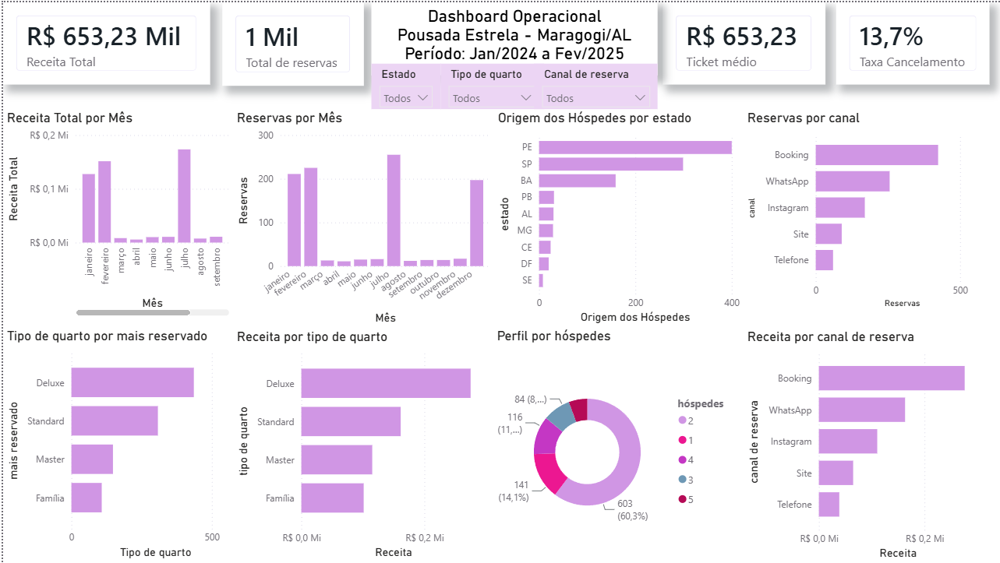

˙⋆✮ Análise de Dados da Pousada Estrela em Maragogi, AL 

Este projeto foi desenvolvido com o objetivo de aplicar conceitos de Análise de Dados em um cenário inspirado na realidade do turismo de Maragogi, Alagoas, um dos principais destinos turísticos do litoral nordestino.
Para isso, foi criada uma base de dados fictícia contendo 1.000 reservas distribuídas ao longo de diferentes períodos entre 2024 e 2025, simulando a operação de uma pousada de médio porte com aproximadamente 30 quartos. A modelagem dos dados considerou fatores como sazonalidade, perfil dos hóspedes, origem dos visitantes, canais de reserva, categorias de acomodação e comportamento da demanda turística.
A partir da utilização de ferramentas de análise e visualização de dados, o projeto busca identificar padrões de ocupação, avaliar o impacto das temporadas sobre a receita, compreender o perfil dos hóspedes e gerar insights que possam auxiliar gestores na tomada de decisões estratégicas.
Além de representar uma oportunidade para desenvolver e praticar habilidades técnicas relacionadas à área de dados, este projeto também possui um significado pessoal. Sua construção foi baseada em conhecimentos adquiridos por meio da minha experiência profissional anterior na área de hotelaria e turismo, bem como pela minha vivência na região de Maragogi. Dessa forma, o projeto busca unir conhecimento de negócio e aprendizado técnico em um mesmo estudo, aproximando a análise de dados de um contexto real de operação.

˙⋆✮ Por que escolhi este projeto?

Escolhi este projeto por unir experiência profissional, conhecimento de negócio e interesse pela área de Análise de Dados.
Durante minha atuação na área de hotelaria e atendimento ao público, tive contato com processos relacionados à gestão de reservas, sazonalidade, ocupação e perfil dos hóspedes. Além disso, por residir na região de Maragogi há vários anos, acompanho de perto a importância do turismo para a economia local e o comportamento da demanda ao longo do ano.
Como estou em processo de transição para a área de dados, busquei desenvolver um projeto que me permitisse aplicar conceitos de análise, visualização e interpretação de dados em um contexto que já conheço na prática. Dessa forma, consegui unir aprendizado técnico e conhecimento de negócio em um único estudo, tornando a análise mais próxima de um cenário real.

˙⋆✮ Perguntas de Negócio

A análise foi desenvolvida para responder questões relevantes para a gestão de uma pousada de médio porte, tais como:

⋆ Quais períodos do ano concentram o maior volume de reservas?

⋆ Como a sazonalidade impacta a receita da pousada?

⋆ Qual é o perfil predominante dos hóspedes?

⋆ Quais estados e cidades mais enviam visitantes para a região?

⋆ Quais canais de reserva apresentam melhor desempenho?

⋆ Qual categoria de quarto possui maior demanda?

⋆ Como as reservas e o faturamento se distribuem ao longo do ano?

⋆ Qual é a taxa de cancelamento observada no período analisado?

Responder a essas perguntas permite compreender melhor o comportamento dos hóspedes e identificar oportunidades para apoiar a tomada de decisões estratégicas.

˙⋆✮ Metodologia de Construção da Base de Dados

˙⋆ Objetivo

Desenvolver uma base de dados fictícia capaz de simular a operação de uma pousada de médio porte localizada em Maragogi (AL), permitindo análises relacionadas à ocupação, receita, sazonalidade, perfil dos hóspedes e desempenho dos canais de venda.
Embora os dados sejam fictícios, a modelagem foi construída com base em características observadas no turismo da região, buscando representar um cenário plausível para fins de estudo e análise.

˙⋆ Porte da Operação

A pousada foi modelada como um empreendimento de médio porte, com aproximadamente 30 quartos.
Esse porte foi escolhido por representar uma realidade comum entre pousadas da região e por permitir um volume de reservas compatível com a demanda turística local.
A base contempla 1.000 reservas distribuídas entre os anos de 2024 e 2025.

˙⋆ Sazonalidade

A distribuição das reservas foi construída para refletir o comportamento sazonal característico do turismo em Maragogi.

˙ Alta Temporada

Período:

⋆ Dezembro de 2024

⋆ Janeiro de 2025

⋆ Fevereiro de 2025

Representa aproximadamente 60% das reservas.

Essa concentração ocorre em função de fatores como:

⋆ Férias escolares

⋆ Festividades de fim de ano

⋆ Verão

⋆ Carnaval

Tradicionalmente, esse é o período de maior movimento turístico da região.

˙ Média Temporada

Período:

⋆ Julho de 2024

Representa aproximadamente 25% das reservas.

Apesar de ocorrer durante o período chuvoso em parte do Nordeste, julho também coincide com as férias escolares de meio de ano, contribuindo para um aumento temporário da demanda turística.

˙ Baixa Temporada

Período:

⋆ Demais meses de 2024

Representa aproximadamente 15% das reservas.

Esses meses apresentam menor fluxo de visitantes quando comparados aos períodos de férias, concentrando principalmente viagens planejadas, feriados prolongados e turismo regional.

˙⋆ Origem dos Hóspedes

A distribuição geográfica foi baseada em estados que tradicionalmente possuem forte presença no turismo da região.

Os estados com maior participação na base foram:

⋆ Pernambuco

⋆ São Paulo

⋆ Bahia

A escolha considera fatores como proximidade geográfica, tamanho populacional e histórico de emissão de turistas para destinos do litoral nordestino.

Também foram incluídos hóspedes provenientes de:

⋆ Alagoas

⋆ Paraíba

⋆ Ceará

⋆ Sergipe

⋆ Distrito Federal

⋆ Minas Gerais

A fim de representar visitantes regionais e ampliar a diversidade da base.

˙⋆ Perfil dos Hóspedes

A modelagem considerou o perfil predominante dos visitantes de Maragogi, destino amplamente associado ao turismo de lazer.

Por esse motivo:

⋆ Reservas para 2 hóspedes representam a maior parte da base.
⋆ Reservas individuais possuem participação reduzida.
⋆ Reservas para grupos familiares aparecem em menor proporção.

Essa distribuição busca reproduzir um cenário compatível com o perfil turístico frequentemente observado na região.

˙⋆ Tipos de Quarto

Foram definidas quatro categorias de acomodação:

˙ Standard

⋆ Capacidade máxima de 2 hóspedes.

˙ Deluxe

⋆ Capacidade máxima de 2 hóspedes.

⋆ Inclui varanda com vista para o mar.

˙ Master

⋆ Capacidade máxima de 4 hóspedes.

⋆ Inclui banheira e comodidades adicionais.

˙ Família

⋆ Capacidade máxima de 5 hóspedes.

⋆ Projetado para grupos familiares ou pequenos grupos.

Todas as reservas respeitam a capacidade máxima de cada acomodação, garantindo consistência operacional na base de dados.

Para fins da simulação, foi considerado que crianças de colo não são contabilizadas como hóspedes adicionais e não geram cobrança extra de hospedagem.

A categoria Deluxe foi configurada como a mais reservada, simulando um cenário em que os hóspedes buscam maior conforto sem atingir os valores das categorias superiores.

˙⋆ Canais de Venda

A distribuição dos canais de reserva foi baseada em tendências atuais observadas no setor hoteleiro.

Maior participação:

⋆ Booking

Participação intermediária:

⋆ WhatsApp

⋆ Instagram

Menor participação:

⋆ Site próprio

⋆ Telefone

O objetivo é representar a crescente relevância dos canais digitais na captação de reservas.

˙⋆ Política de Preços

Os valores das reservas foram definidos considerando:

⋆ Categoria da acomodação

⋆ Quantidade de noites reservadas

⋆ Período da hospedagem

Também foi aplicada diferenciação tarifária entre dias úteis e finais de semana, simulando práticas comuns adotadas pelo setor de hospedagem para adequação da oferta à demanda.

˙⋆ Premissas Utilizadas

Por se tratar de uma base fictícia, algumas premissas foram adotadas para garantir consistência e realismo na simulação:

⋆ A pousada possui aproximadamente 30 quartos.

⋆ A demanda turística segue padrões sazonais observados na região.

⋆ Casais representam o principal perfil de hóspedes.

⋆ As reservas respeitam a capacidade máxima de cada acomodação.

⋆ Os preços variam de acordo com o tipo de quarto e o período da hospedagem.

⋆ Nenhum dado pessoal real foi utilizado na construção da base.

˙⋆ Finalidade Analítica

A estrutura da base foi planejada para permitir análises relacionadas a:

⋆ Receita total

⋆ Ticket médio

⋆ Taxa de cancelamento

⋆ Desempenho dos canais de venda

⋆ Perfil dos hóspedes

⋆ Distribuição geográfica dos visitantes

⋆ Impacto da sazonalidade

⋆ Comparação entre categorias de acomodação

O objetivo não é reproduzir dados de uma empresa específica, mas sim criar um ambiente realista para o desenvolvimento de habilidades em análise de dados, permitindo a formulação de hipóteses, geração de insights e elaboração de recomendações baseadas em evidências.

˙⋆✮ Estrutura dos Dados

A base de dados foi construída com o objetivo de representar reservas realizadas em uma pousada fictícia localizada em Maragogi (AL).
Cada linha da tabela representa uma reserva individual e contém informações relacionadas ao período da hospedagem, origem dos hóspedes, canal de aquisição, categoria do quarto e valor financeiro da reserva.

As principais colunas utilizadas são:

| Coluna               | Descrição                                                      |
| -------------------  | -------------------------------------------------------------- |
| id_reserva           | Identificador único da reserva                                 |
| data_reserva         | Data em que a reserva foi realizada                            |
| checkin              | Data prevista para entrada do hóspede                          |
| periodo_estadia      | Quantidade de noites reservadas                                |
| cidade_origem        | Cidade de origem do hóspede                                    |
| estado_origem        | Estado de origem do hóspede                                    |
| canal_reserva        | Canal utilizado para realizar a reserva                        |
| status_reserva       | Situação da reserva (Confirmada ou Cancelada)                  |
| tipo_quarto          | Categoria da acomodação reservada                              |
| quantidade_hospedes  | Número de hóspedes da reserva                                  |
| valor_reserva        | Valor total da reserva em reais                                |

˙⋆ Resumo da Base

⋆ Total de registros: 1.000 reservas

⋆ Período analisado: Janeiro de 2024 a Fevereiro de 2025

⋆ Tipos de quarto: Standard, Deluxe, Master e Família

⋆ Principais canais de venda: Booking, WhatsApp, Instagram, Site e Telefone

⋆ Abrangência geográfica: hóspedes provenientes de diferentes estados brasileiros, com foco nos principais emissores de turistas para a região

Essa estrutura foi planejada para possibilitar análises relacionadas à receita, sazonalidade, perfil dos hóspedes, desempenho dos canais de venda e comportamento da demanda ao longo do período estudado.

˙⋆✮ Ferramentas Utilizadas

As análises e visualizações apresentadas neste projeto foram desenvolvidas utilizando as seguintes ferramentas:

| Ferramenta    | Finalidade                                                      |
| ------------- | --------------------------------------------------------------- |
| Excel         | Manipulação inicial dos dados e validação da base               |
| Power BI      | Construção do dashboard e visualização dos indicadores          |
| GitHub        | Versionamento e documentação do projeto                         |
| SQL           | Consultas à base de dados, que contém tabelas de outros anos    |

˙⋆ Competências Praticadas

Durante o desenvolvimento deste projeto foram aplicados conceitos relacionados a:

⋆ Estruturação de bases de dados

⋆ Análise exploratória de dados

⋆ Definição de indicadores (KPIs)

⋆ Visualização de dados

⋆ Storytelling com dados

⋆ Interpretação de métricas de negócio

⋆ Geração de insights e recomendações

Embora a base utilizada seja fictícia, o projeto foi desenvolvido seguindo uma lógica próxima à encontrada em cenários reais de negócio, buscando transformar dados em informações úteis para a tomada de decisão.

˙⋆✮ Dashboard

Com o objetivo de transformar os dados em informações de fácil interpretação, foi desenvolvido um dashboard interativo no Power BI reunindo os principais indicadores da operação da pousada.

O painel foi estruturado para permitir uma visão geral do negócio, possibilitando a análise de receita, sazonalidade, perfil dos hóspedes, canais de venda e desempenho das categorias de acomodação.

˙⋆✮ Visão Geral

  

Principais indicadores apresentados:

⋆ Receita Total

⋆ Ticket Médio

⋆ Total de Reservas

⋆ Taxa de Cancelamento

⋆ Receita por Mês

⋆ Reservas por Estado

⋆ Reservas por Canal

⋆ Reservas por Tipo de Quarto

˙⋆✮ Principais Insights

˙⋆ 1. A alta temporada concentrou a maior parte da demanda

A análise demonstrou que a maior parte das reservas ocorreu entre dezembro de 2024 e fevereiro de 2025, período que concentrou aproximadamente 60% do volume total de hospedagens.
Esse comportamento evidencia a forte influência da sazonalidade sobre a operação da pousada e reforça a importância do planejamento para os períodos de maior demanda.

˙⋆ 2. Casais representaram o perfil predominante dos hóspedes

Reservas para duas pessoas foram amplamente predominantes ao longo do período analisado.
O resultado está alinhado com o perfil turístico frequentemente associado a destinos de praia e lazer, indicando que ações de marketing voltadas para casais podem apresentar maior potencial de conversão.

˙⋆ 3. O quarto Deluxe foi a categoria mais procurada

Entre as acomodações disponíveis, a categoria Deluxe apresentou o maior volume de reservas.
Esse comportamento sugere que os hóspedes valorizam diferenciais de conforto e experiência, desde que os valores permaneçam acessíveis quando comparados às categorias superiores.

˙⋆ 4. O Booking foi o principal canal de aquisição

A maior parte das reservas foi originada através do Booking, superando os demais canais de venda.
O resultado evidencia a relevância das plataformas online para a captação de hóspedes, mas também indica a necessidade de monitorar a dependência de um único canal.

˙⋆ 5. Pernambuco, São Paulo e Bahia concentraram a maior parte dos visitantes

A análise geográfica revelou maior participação de hóspedes provenientes desses estados.
Esse comportamento sugere oportunidades para campanhas segmentadas e ações de marketing direcionadas aos mercados que já demonstram maior interesse pelo destino.

˙⋆ 6. A receita acompanhou o comportamento da sazonalidade

Os meses de maior demanda também apresentaram os maiores níveis de faturamento.
Esse resultado demonstra a forte correlação entre ocupação e receita, reforçando a importância de estratégias comerciais específicas para os períodos de baixa temporada.

˙⋆ 7. A diversificação de categorias permitiu atender diferentes perfis de hóspedes

Embora o quarto Deluxe tenha liderado em quantidade de reservas, as demais categorias contribuíram para atender públicos com necessidades distintas, ampliando as possibilidades de venda da pousada.

˙⋆✮ Resultados Obtidos

Ao longo do período analisado, a pousada registrou:

⋆ Receita Total: R$ 653.230,00

⋆ Total de Reservas: 1.000

⋆ Ticket Médio: R$ 653,23

⋆ Taxa de Cancelamento: 13,7%

Também foi observado que:

⋆ A categoria Deluxe foi a mais reservada.

⋆ Reservas para 2 hóspedes representaram mais de 60% da demanda.

⋆ O Booking foi o principal canal de aquisição.

⋆ Pernambuco, São Paulo e Bahia concentraram a maior parte dos visitantes.

˙⋆✮ Recomendações

Com base nos resultados encontrados, algumas ações poderiam ser consideradas:

⋆ Desenvolver campanhas específicas para baixa temporada.

⋆ Incentivar avaliações no Booking para fortalecer a reputação da pousada.

⋆ Investir em canais próprios, como WhatsApp e Site, para reduzir dependência de plataformas terceirizadas.

⋆ Criar pacotes voltados para casais, principal público identificado na análise.

⋆ Explorar estratégias de upsell para aumentar a ocupação dos quartos Master e Família.

˙⋆✮  Limitações

Este projeto utiliza uma base de dados fictícia criada para fins educacionais. Embora a modelagem tenha sido inspirada em características reais do turismo de Maragogi, os resultados não representam dados operacionais de nenhuma empresa específica. Consequentemente, os insights apresentados devem ser interpretados como exercícios de análise e não como diagnósticos reais de mercado.

˙⋆✮ Próximos Passos

Possíveis evoluções futuras para este projeto incluem:

⋆ Melhoria do banco de dados relacional.

⋆ Criação de dashboards avançados com segmentações adicionais.

⋆ Implementação de automações para envio de relatórios.

⋆ Desenvolvimento de um site fictício para a pousada.

⋆ Integração com APIs de reservas e sistemas de gestão hoteleira.

